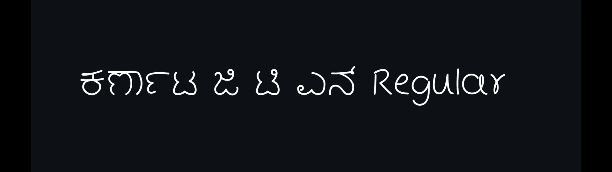
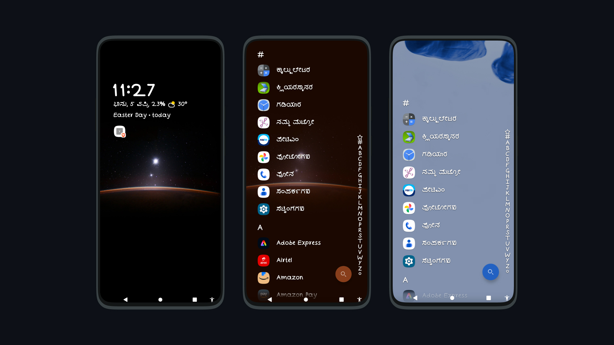

# ಕರ್ನಾಟ ಜಿ ಟಿ ಎನ್ ಟೈಪ್‌ಫೇಸ್ / Karnata GTN TypeFace

ಕರ್ನಾಟ ಜಿ ಟಿ ಎನ್ ಎಂಬುದು ಜಿ. ಟಿ. ನಾರಾಯಣ್ ರಾವ್ ಅವರ ಕೈಬರಹ ಶೈಲಿಯನ್ನು ಆಧರಿಸಿದ ವೇರಿಯಬಲ್ ಕನ್ನಡ ಟೈಪ್‌ಫೇಸ್ ಆಗಿದೆ.

Karnata GTN is a variable Kannada typeface based on the handwriting style of G. T. Narayan Rao.

  

## ಅವಲೋಕನ / Overview

- Type: Variable Font  
- Scripts: Kannada, Latin  
- Glyphs: 549  
- License: SIL Open Font License 1.1  

## Variable Axis

- Weight (wght): 400 → 900

  

### Instances
Regular · Medium · SemiBold · Bold · ExtraBold · Black

## ಯೋಜನೆಯ ಬಗ್ಗೆ / About

ಕರ್ನಾಟ ಜಿ ಟಿ ಎನ್ ಕೈಬರಹ ಮತ್ತು ಅಕ್ಷರಶೈಲಿಗಳ ನಡುವೆ ಸೇತುವೆ ಇದ್ದಂತೆ, ಕೈಬರಹ ಅಕ್ಷರ ಮತ್ತು ಮುದ್ರಣಾಕ್ಷರದ ನಡುವೆ ಒಂದು ಮಧ್ಯಮ ಮೈದಾನವಾಗುತ್ತದೆ. ಇದನ್ನು UI, ವೆಬ್ ಮತ್ತು ಪ್ರಕಟಣೆ ಸೇರಿದಂತೆ ಆಧುನಿಕ ಡಿಜಿಟಲ್ ಬಳಕೆಗಾಗಿ ವಿನ್ಯಾಸಗೊಳಿಸಲಾಗಿದೆ.

ಇದು ಕನ್ನಡದಲ್ಲಿ ವೇರಿಯಬಲ್ ಫಾಂಟ್ ತಂತ್ರಜ್ಞಾನವನ್ನು ಒಳಗೊಂಡ ಆರಂಭಿಕ ಫಾಂಟ್ಗಳಲ್ಲಿ ಒಂದಾಗಿದೆ, ಸ್ಥಿರ ಶೈಲಿಗಳ ಬದಲಿಗೆ ಫಾಂಟ್ ತೂಕದ ಮೇಲೆ ನಿರಂತರ ನಿಯಂತ್ರಣವನ್ನು ಸಕ್ರಿಯಗೊಳಿಸುತ್ತದೆ.

Karnata GTN bridges handwritten expression and formal typography, creating a balance between natural writing and readable text. It is designed for modern digital use, including UI, web, and publishing.

This is one of the early variable font implementations in Kannada, enabling continuous control over font weight instead of fixed styles.

## ಬಳಕೆ / Usage

ವೇರಿಯಬಲ್ ಫಾಂಟ್‌ಗಳು ಪೂರ್ವನಿರ್ಧರಿತ ಶೈಲಿಗಳಲ್ಲದೆ, 400–900 ನಡುವಿನ ಯಾವುದೇ ತೂಕದ ಮೌಲ್ಯವನ್ನು ಆಯ್ಕೆ ಮಾಡಲು ಅನುಮತಿಸುತ್ತದೆ.
Variable fonts allow selecting any weight value between 400 and 900, not just predefined styles.

ಉಪಯುಕ್ತ:
- UI/UX ವಿನ್ಯಾಸ
- ಸ್ಪಂದನಾತ್ಮಕ ವಿನ್ಯಾಸ
- ವೆಬ್ ಮತ್ತು ಅಪ್ಲಿಕೇಶನ್ ಇಂಟರ್ಫೇಸ್‌ಗಳು

Useful for:
- UI/UX design
- Responsive typography
- Web and app interfaces

## Contributors

Arun C Kallappanavar

Vaishnavi Murthy

Omshivaprakash H L

Abhaya Simha

GTN family

Prem Kumar M 

Krishna Kumar B

Bhimaraj S Kotabagi

## License

This font is licensed under the SIL Open Font License 1.1.
http://scripts.sil.org/OFL
